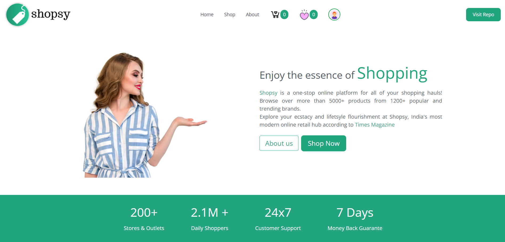
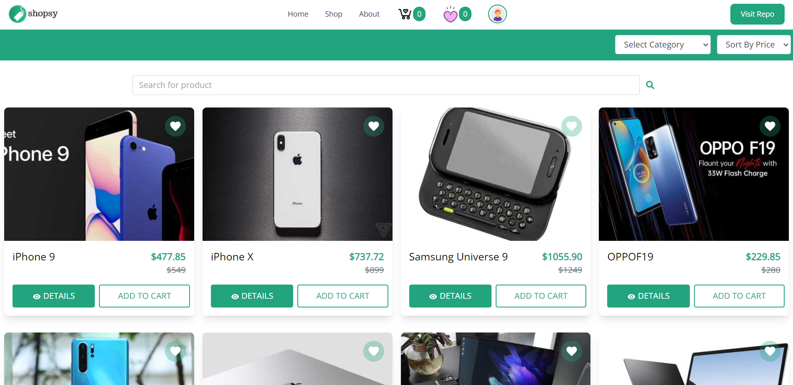
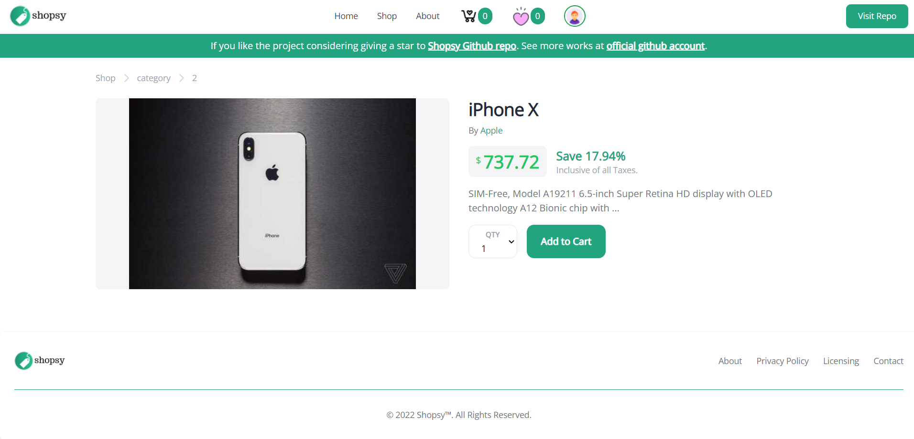
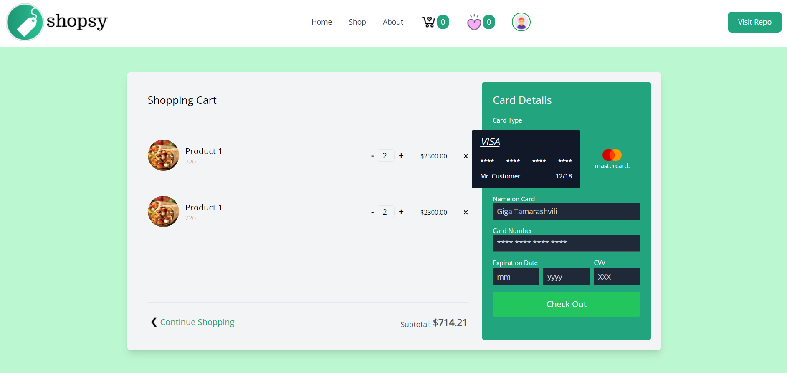
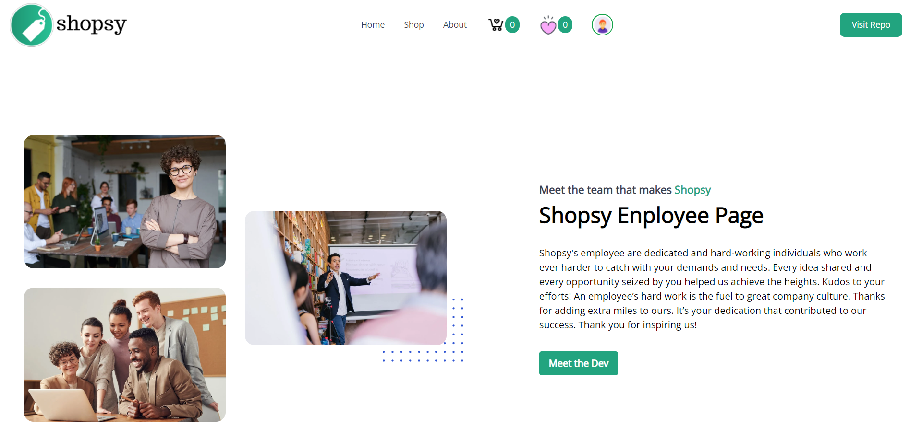

# Shopsy eCommerce React Application

  

## Introduction

Shopsy is a eCommerce application made using React and Redux. The aim of the project is to prove the proficiency in react based technologies and my love for react.

## Screenshots

home page

  

Shop page

  

Product Detail Page

  

Product Cart Page

  

About Page

  

## Technologies

- React.js
- Redux
- React-Redux
- Axios
- Typescript
- React-Router-Dom

## Skills demonstrated

- Proficient in working with APIs
- Proficient in working with react-based technologies
- Efficient in creating single-page applications.

## Author

Hi! my name is [Syed Vilayat Ali Rizvi](https://vilayat.herokuapp.com/) and I am an Indian Full-Stack web developer, software engineer and ML engineer. I am also a passionate innovator and technepreneur.
